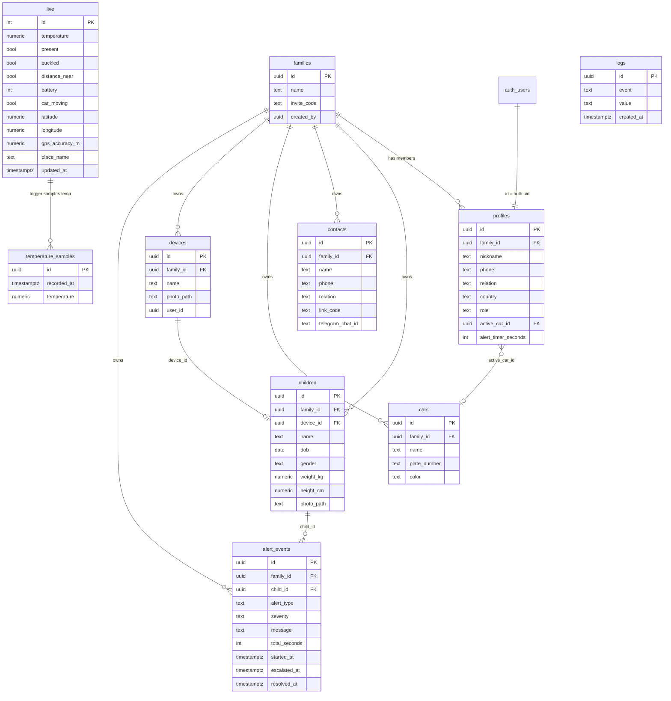

# Waby — Database Reference

| | |
|---|---|
| **Backend** | Supabase Postgres (project `pvafygrloelptlmnhfog`) |
| **Client** | Flutter via `supabase_flutter` |
| **Authority** | Live schema in Supabase is authoritative; this ERD is maintained by hand |
| **Last updated** | 2026-08-15 |

---

## ERD

---

## Tables

### `live` — single shared telemetry row (`id = 1`)

| Column | Type | Notes |
|--------|------|-------|
| `id` | int | Primary key; demo/project uses **only** `id = 1` |
| `temperature` | numeric | Seat °C from DHT11 |
| `present` | bool | Infant presence (FSR) |
| `buckled` | bool | Buckle latched |
| `distance_near` | bool | Caregiver near seat. **App-owned:** BLE RSSI of the `WabySeat` beacon. Firmware does not PATCH this field. |
| `battery` | int | Device battery % |
| `battery_voltage` | numeric | Pack voltage from firmware (optional) |
| `car_moving` | bool | GPS-derived motion flag |
| `latitude` | numeric | GPS latitude |
| `longitude` | numeric | GPS longitude |
| `gps_accuracy_m` | numeric | From HDOP when valid |
| `place_name` | text | Reverse-geocode cache |
| `updated_at` | timestamptz | Auto-stamped via trigger on write |

**RLS:** Authenticated app users may **UPDATE** only the row where `id = 1`. ESP32 writes are intended via the **service role** (bypasses RLS). Multi-device live rows are out of scope.

---

### `temperature_samples` — 12-hour DHT history

`live` is a single overwriting row, so temperature analytics cannot be read from `live` alone. A trigger on `live` INSERT/UPDATE of `temperature` inserts at most **one sample per minute** and prunes rows older than 13 hours.

| Column | Type | Notes |
|--------|------|-------|
| `id` | uuid | Primary key |
| `recorded_at` | timestamptz | Sample time (default `now()`) |
| `temperature` | numeric | Seat °C from the `live` PATCH |

**RLS:** Authenticated users may **SELECT** and **INSERT**. The trigger runs as `security definer` so ESP32 PATCHes still record history when the app is closed.

**Deploy:** run `supabase/migrations/20260815_temperature_samples.sql` in the Supabase SQL editor if the CLI is not linked.

---

### `logs` — append-only alert evidence

| Column | Type | Notes |
|--------|------|-------|
| `id` | uuid | Primary key |
| `event` | text | e.g. alert reason name |
| `value` | text | Human-readable message |
| `created_at` | timestamptz | Insert time |

**RLS:** App users may **INSERT** only. Used for viva / demo evidence (`AlertService._writeLog`).

---

### `alert_events` — family-scoped escalation records

| Column | Type | Notes |
|--------|------|-------|
| `id` | uuid | Primary key |
| `family_id` | uuid | Family scope |
| `child_id` | uuid | Child under alert |
| `alert_type` | text | e.g. `heat`, `left_behind`, `buckle` |
| `severity` | text | e.g. `caution`, `warning`, `critical` |
| `message` | text | Display / Telegram copy |
| `total_seconds` | int | Escalation window length |
| `started_at` | timestamptz | When tracking began |
| `escalated_at` | timestamptz | Set when Telegram path claimed |
| `resolved_at` | timestamptz | Set when alert cleared |

**Server job:** `check_alert_escalations()` runs on **pg_cron every 30s**, claiming due rows with `FOR UPDATE SKIP LOCKED` so app and server do not double-send.

---

### `profiles` — one row per auth user (`id = auth.uid()`)

| Column | Type | Notes |
|--------|------|-------|
| `id` | uuid | Equals `auth.users.id` |
| `family_id` | uuid | Null until create/join family |
| `nickname` | text | Preferred display name |
| `phone` | text | |
| `relation` | text | e.g. Mother, Father |
| `country` | text | |
| `role` | text | `admin` or `user` |
| `active_car_id` | uuid | FK → `cars`; set via `set_active_car` |
| `alert_timer_seconds` | int | Escalation window (UI 30–90; default 60) |

Also used by the client: `full_name`, `email`, `avatar_path`, `created_at` (see Flutter selects).

**RLS:** Family-scoped reads/writes for members of the same family.

---

### `families`

| Column | Type | Notes |
|--------|------|-------|
| `id` | uuid | Primary key |
| `name` | text | Family display name |
| `invite_code` | text | Join code (client normalises trim/uppercase) |
| `created_by` | uuid | Owner profile id |

---

### `children`

| Column | Type | Notes |
|--------|------|-------|
| `id` | uuid | Primary key |
| `family_id` | uuid | Stamped by `stamp_family_id` **BEFORE INSERT** trigger |
| `device_id` | uuid | Linked seat device |
| `name` | text | Required |
| `dob` | date | |
| `gender` | text | Check: `Boy` / `Girl` (or null) — migration `20260729_add_children_gender.sql` |
| `weight_kg` | numeric | |
| `height_cm` | numeric | |
| `photo_path` | text | Storage path under `avatars` |

---

### `contacts` — emergency / Telegram recipients (not app users)

| Column | Type | Notes |
|--------|------|-------|
| `id` | uuid | Primary key |
| `family_id` | uuid | Stamped by `stamp_family_id` trigger |
| `name` | text | |
| `phone` | text | |
| `relation` | text | |
| `link_code` | text | Sent to `@WabyBabyBot` to link |
| `telegram_chat_id` | text | Set after bot link; null = not linked |

---

### `cars`

| Column | Type | Notes |
|--------|------|-------|
| `id` | uuid | Primary key |
| `family_id` | uuid | Stamped by `stamp_family_id` trigger |
| `name` | text | |
| `plate_number` | text | Optional |
| `color` | text | Hex string, e.g. `#3B74BC` |

Included in the **Realtime** publication (active-car / car list updates).

---

### `devices`

| Column | Type | Notes |
|--------|------|-------|
| `id` | uuid | Primary key |
| `family_id` | uuid | Stamped by `stamp_family_id` trigger |
| `name` | text | Seat / device label |
| `photo_path` | text | Optional |
| `user_id` | uuid | Creating caregiver |

---

## Security-definer RPCs

| RPC | Purpose | Client usage |
|-----|---------|--------------|
| `current_family_id()` | Helper returning the caller's `profiles.family_id` | Used by RLS policies / triggers |
| `create_family(p_name)` | Create family, set caller as owner, stamp profile | `FamilyService.createFamily` |
| `lookup_family_by_code(p_code)` | Resolve invite code → family name **without** joining | `FamilyService.lookupFamilyByCode` |
| `join_family(p_code)` | Join family by invite code; returns family name | `FamilyService.joinFamily` |
| `set_active_car(p_car_id)` | Set or clear `profiles.active_car_id` | `FamilyService.setActiveCar` |
| `leave_family()` | Clear caller's family membership | `FamilyService.leaveFamily` |
| `remove_family_member(p_target)` | Owner removes a member | `FamilyService.removeFamilyMember` |

---

## Storage

| Bucket | Access | Path convention |
|--------|--------|-----------------|
| `avatars` | Private | `{family_id}/{entityType}/{entityId}.jpg` |

Signed URL expiry in client ≈ 3600s.

---

## Maintenance notes

- Authoritative schema lives in Supabase project `pvafygrloelptlmnhfog`.
- Repo migrations under `supabase/migrations/` are partial; always reconcile this doc when applying SQL in the dashboard or CLI.
- When RLS, RPCs, triggers, or Edge Functions change, update this file and `docs/API.md` in the same change.
